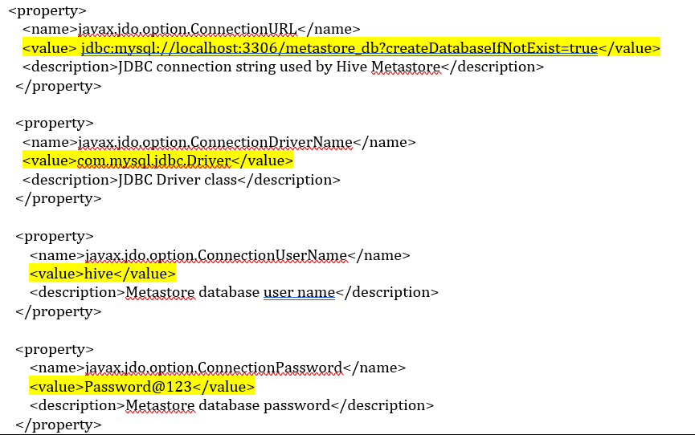
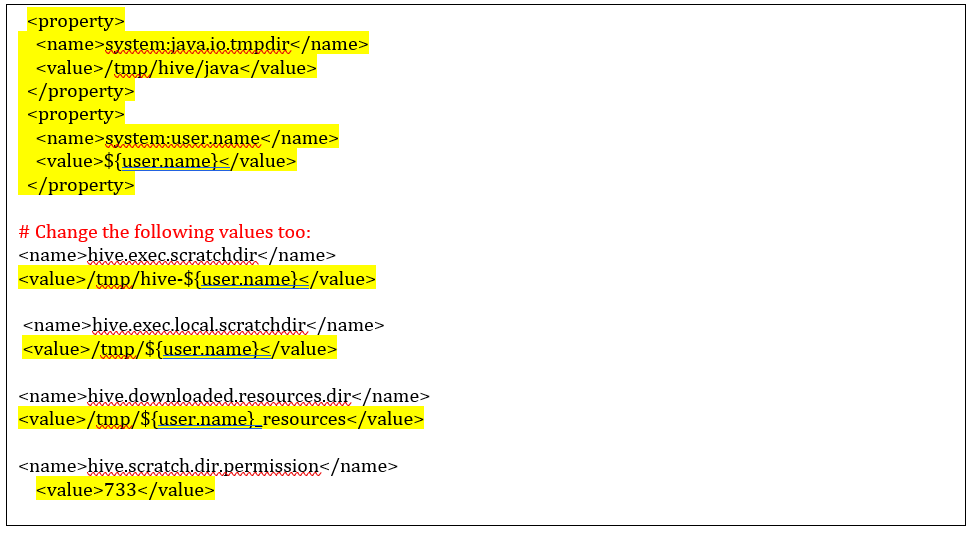

# Hive Installation Instructions

## 1) Download and untar Hive

Find download link from https://hive.apache.org/general/downloads/ (In this case, we will be using Hive 3.1.3). Use wget.

```
cd ~

wget https://dlcdn.apache.org/hive/hive-3.1.3/apache-hive-3.1.3-bin.tar.gz

tar xzf apache-hive-3.1.3-bin.tar.gz
```

## 2) Configure Hive environment variables

```
vim ~/.bashrc
```

Append the following lines to the bottom of the file:

```
export HIVE_HOME=~/apache-hive-3.1.3-bin
export PATH=$PATH:$HIVE_HOME/bin
```

Exit using [esc] > :wq
Source .bashrc
```
source ~/.bashrc
```

## 3) Edit hive-config.sh

```
vim $HIVE_HOME/bin/hive-config.sh
```

Add following export to bottom of file:

```
export HADOOP_HOME=~/hadoop/hadoop-3.3.6
```

Save and exit the file

## 4) Create Hive directories in HDFS
Make sure HDFS daemons are up and running.
```
cd ~/hadoop/hadoop-3.3.6
sbin/start-dfs.sh
sbin/start-yarn.sh

```
### Create tmp directory
Create directory and add permissions to group members
```
hdfs dfs -mkdir /tmp
hdfs dfs -chmod g+w /tmp
```

You can check to make sure that the directory and permissions are set correctly using -ls

```
hdfs dfs -ls /
```
### Create warehouse directory
```
hdfs dfs -mkdir -p /user/hive/warehouse
hdfs dfs -chmod g+w /user/hive/warehouse
```

## 5) Configure hive-site.xml

```
cd $HIVE_HOME/conf

cp hive-default.xml.template hive-site.xml
```

On line 460, edit the value of the property to look like this (you can use a search command in vim by typing /[string to search]):

```
    <property>
        <name>hive.metastore.warehouse.dir</name>
        <value>/user/hive/warehouse</value>
        <description>location of default database for the warehouse</description>
    </property>
```

Search for "&#8" in the hive-site.xml file and remove those characters.

## 6) Install MySQL
```
sudo apt-get install mysql-server
sudo service mysql start
sudo mysql_secure_installation utility
```

This will enter a start wizard for MySQL. Things to note:
- Enter a password for the root user
- specify n for "Would you like to setup VALIDATE PASSWORD component?"
- specify n for "Remove anonymous users?"
- specify n for "Disallow root login remotely?"
- specify n for "Remove test database and access to it?"
- specify y for "Reload privilege tables now?"

## 7) Configure MySQL JDBC connector

```
wget https://dev.mysql.com/get/Downloads/Connector-J/mysql-connector-java-8.0.30.tar.gz
cp mysql-connector-java-8.0.30.tar.gz $HIVE_HOME/lib
tar xzf mysql-connector-java-8.0.30.tar.gz
cd mysql-connector-java-8.0.30
mv mysql-connector-java-8.0.30.jar ./..
```

## 8) Create Hive user in MySQL

```
sudo mysql -u root -p
```
Once logged in, run the following MySQL commands:
```
CREATE USER 'hive'@'localhost' IDENTIFIED BY 'Password@123';

GRANT ALL PRIVILEGES ON *.* to 'hive'@'localhost' WITH GRANT OPTION;

flush privileges;
```

If metastore_db exists, delete it. It will be recreated when we start Hive. Then exit:

```
Show databases;
Drop database metastore_db;
exit;
```

## 9) Apply mysql settings in hive-site.xml and hive-env.sh

```
vim $HIVE_HOME/conf/hive-site.xml
```

Apply these changes (serch for property names in vim using /[search string]):


Save and exit.

```
vim $HIVE_HOME/conf/hive-env.sh
```

Add this export to the end of the file:
```
export HADOOP_HOME=~/hadoop/hadoop-3.3.6
```

## 10 Initiate database
Hive will use MySQL to store metadata. Initiate:

```
$HIVE_HOME/bin/schematool -initSchema  -dbType mysql
```

### Potential error
If you get an error like "Exception in thread "main" java.lang.NoSuchMethodError:com.google.common.base.Preconditions.checkArgument(ZLjava/lang/String:Ljava/lang/Object;)V", you have an incompatibility with your guava versions.

Locate guava jar in Hive lib directory:

```
ls $HIVE_HOME/lib
```

Locate guava jar in Hadoop lib:

```
ls $HADOOP_HOME/share/hadoop/hdfs/lib
```

if the guava-*.jar files are not the same, you may have an incompatibility issue. If so, copy the one from Hadoop into Hive.

```
mv $HIVE_HOME/lib/guava-19.0.jar $HIVE_HOME/lib/guava-19.0.jar.old

cp $HADOOP_HOME/share/hadoop/hdfs/lib/guava-27.0-jre.jar $HIVE_HOME/lib/
```

Use the schematool again:
```
$HIVE_HOME/bin/schematool -initSchema  -dbType mysql
```

## 11) Launch Hive
```
cd $HIVE_HOME/bin
hive
```

### Potential error
If you get an “java.net.URISyntaxException when starting HIVE” exception, do the following:

Put the following at the beginning of hive-site.xml (after the opening configuration tag)
